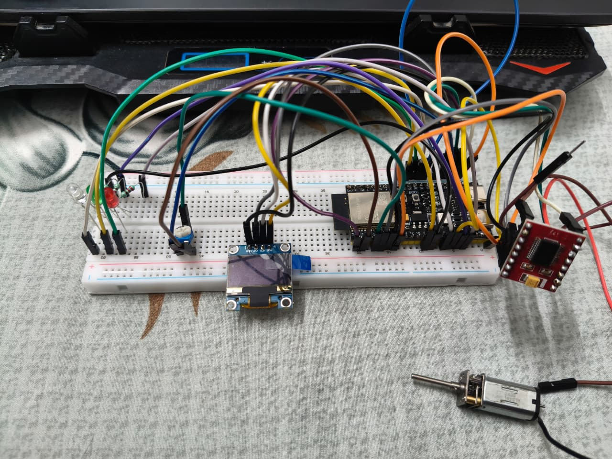
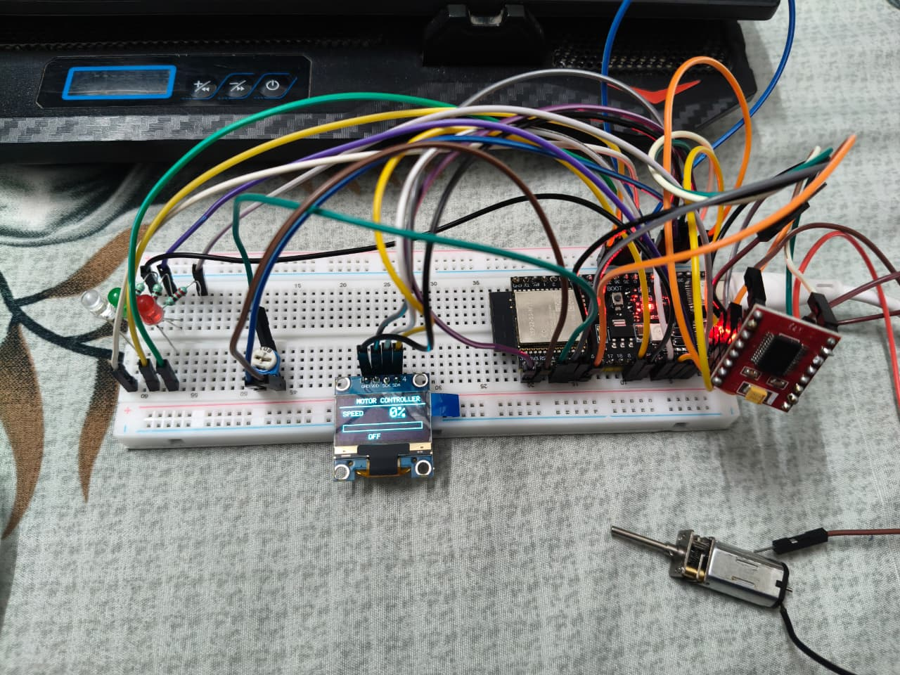
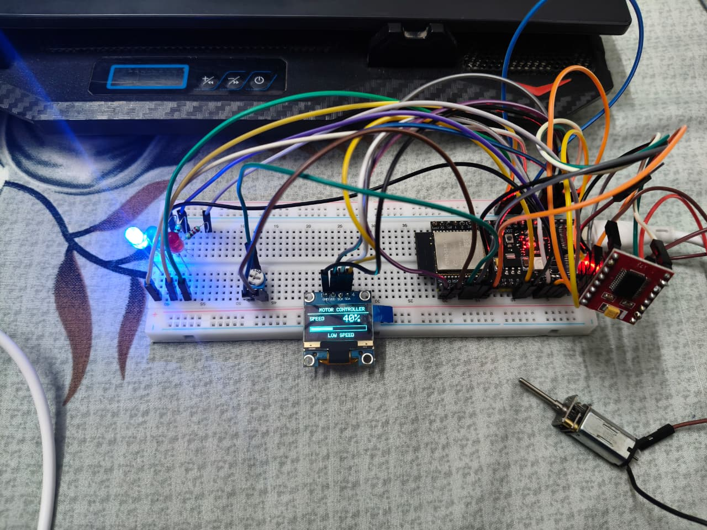
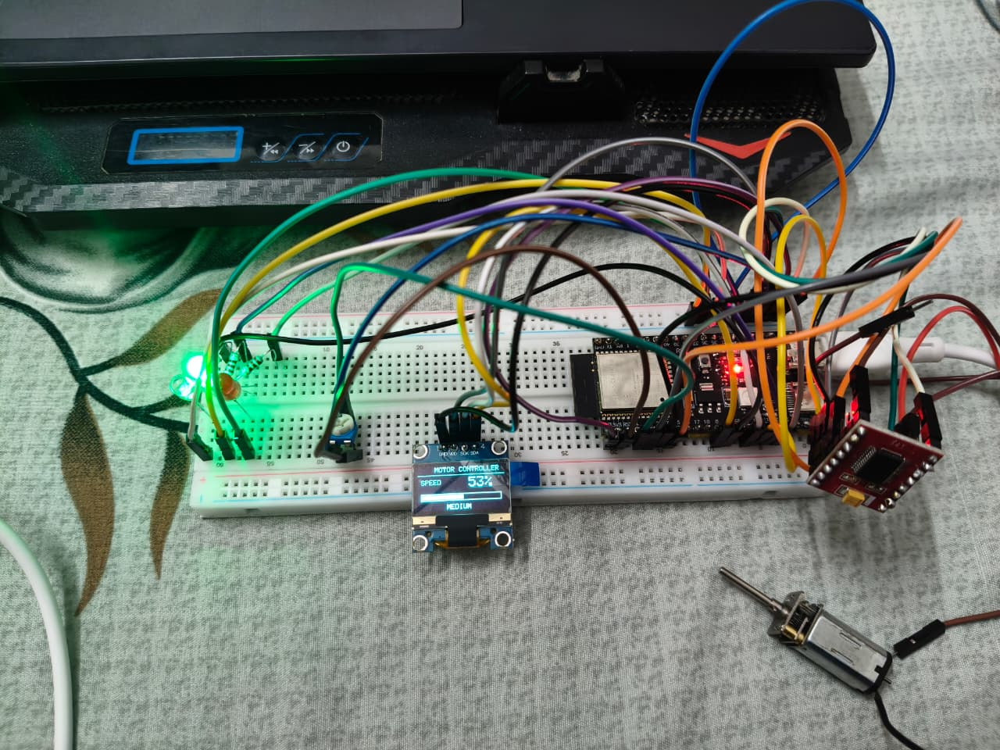
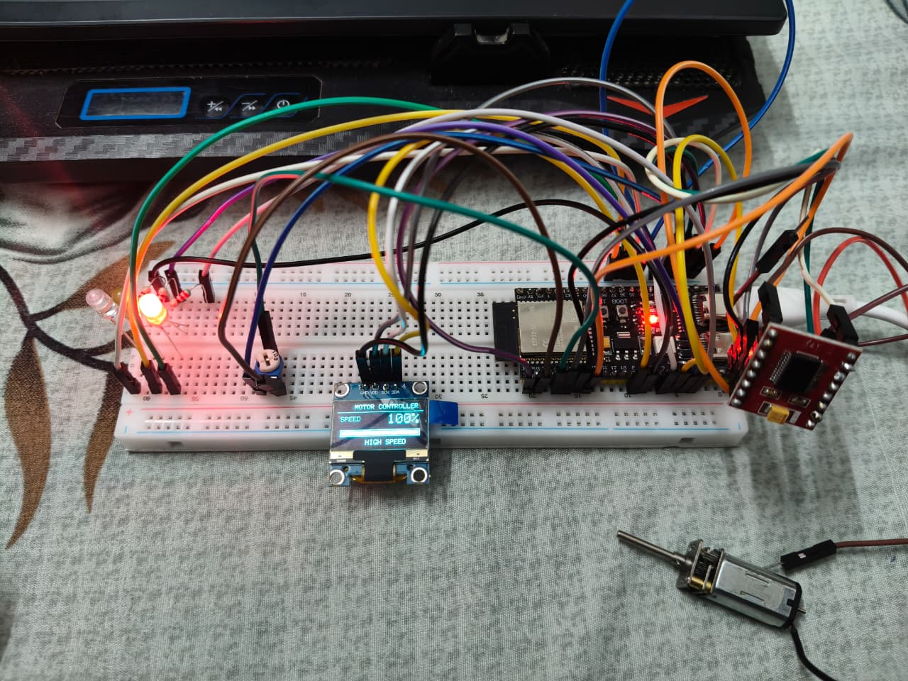

## Results

The system was successfully tested across different motor-speed ranges:

| Speed Range | LED Indication | OLED Status |
|---|---|---|
| 0% | LEDs OFF | OFF |
| 1–49% | Blue | LOW SPEED |
| 50–89% | Green | MEDIUM |
| 90–100% | Red | HIGH SPEED |

The potentiometer controls the PWM duty cycle, while the OLED provides real-time visual feedback of the selected speed range.

# ESP32-S3 Smart DC Motor Speed Controller

A personal Embedded Systems project using an ESP32-S3 to control the speed of a DC geared motor using a potentiometer and PWM.

## Features

- Potentiometer-based motor speed control
- PWM-based DC motor control
- TB6612FNG motor driver
- I2C OLED speed monitoring
- Real-time speed percentage display
- Graphical speed bar
- Three-level LED speed indication

## Hardware Used

- ESP32-S3 DevKit
- TB6612FNG Motor Driver
- DC Geared Motor
- 10kΩ Potentiometer
- I2C OLED Display
- Blue LED
- Green LED
- Red LED
- 220Ω Resistors
- 5V External Power Supply
- Breadboard and jumper wires

## Pin Configuration

| Component | ESP32-S3 Pin |
|---|---|
| Potentiometer | GPIO4 |
| Blue LED | GPIO3 |
| Green LED | GPIO11 |
| Red LED | GPIO12 |
| TB6612 PWMA | GPIO10 |
| TB6612 AIN1 | GPIO5 |
| TB6612 AIN2 | GPIO6 |
| TB6612 STBY | GPIO7 |
| OLED SDA | GPIO8 |
| OLED SCL | GPIO9 |

## Working Principle

The potentiometer provides an analog voltage to the ESP32-S3.

The ESP32-S3 reads the potentiometer using its ADC and converts the reading into a PWM duty cycle.

The PWM signal is sent to the TB6612FNG motor driver, which controls the DC motor.

The OLED displays the calculated speed percentage, speed bar, and operating status.

LED indication:

- 0% → LEDs OFF
- 1–49% → Blue LED
- 50–89% → Green LED
- 90–100% → Red LED

## System Flow

Potentiometer  
↓  
ESP32-S3 ADC  
↓  
PWM Generation  
↓  
TB6612FNG Motor Driver  
↓  
DC Motor

The ESP32-S3 also sends information to the OLED through I2C and controls the status LEDs through GPIO.

## Skills Demonstrated

- Embedded C/C++
- ESP32-S3
- ADC
- PWM
- GPIO
- I2C Communication
- OLED Interfacing
- DC Motor Control
- Motor Driver Interfacing
- Hardware Debugging

## Future Improvements

- Add an encoder or Hall-effect sensor for actual RPM measurement
- Implement closed-loop speed control
- Add buttons for motor direction control
- Add wireless monitoring using ESP32 Wi-Fi/Bluetooth

## Project Demonstration

### Complete Hardware Setup

### Motor OFF — 0%

### Low Speed — 40% — Blue LED

### Medium Speed — 53% — Green LED

### High Speed — 100% — Red LED

